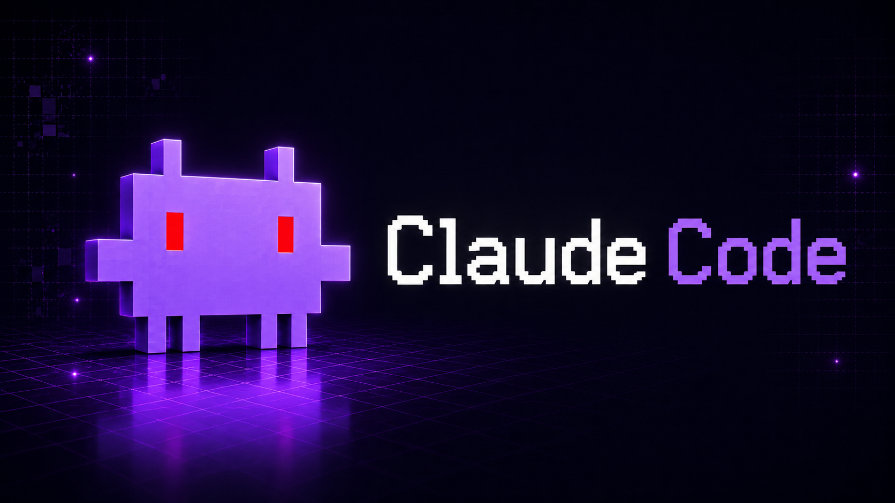

<p align="center">
  
</p>

<p align="center">
  <strong>Language:</strong>
  <a href="README.md"><strong>English</strong></a> ·
  <a href="readme/README.zh.md">中文 (简体)</a> ·
  <a href="readme/README.th.md">ไทย</a>
</p>

# Claude Code

Claude Code is an independent, research-oriented **source-built reverse engineering and reconstruction** project of Anthropic's official [Claude Code](https://claude.ai/code) CLI. 

This project aims to provide a **fully runnable, buildable, and debuggable** version of the code directly from source code—liberating developers from closed-source binaries. In addition, it extends the experience with native multi-provider routing, adapters, and advanced developer utilities.

> **Disclaimer:** This project is not affiliated with, endorsed by, or sponsored by Anthropic PBC. The original Claude Code product is proprietary. This project reconstructs and extends its behaviors strictly for research and self-hosted development environments. Please read [LICENSE.md](LICENSE.md) before distributing or using it in an enterprise setting.

## Project Positioning

| Dimension | What Claude Code Provides |
| --- | --- |
| **Original Fidelity** | A reconstructed CLI conforming to the terminal UX, tools, and extension points of the official Claude Code. |
| **Build & Debug** | A modular Bun/TypeScript codebase tree that can be typechecked, tested, and modified locally using `bun run dev`. |
| **Enterprise Capabilities** | Remote session bridging, MCP, plugins, skills, agents/supervisor, voice, session memory, and LSP integrations—without forcing all workflows to run through Anthropic's hosted-only services. |
| **Our Superpowers** | Declarative **multi-provider** routing (`providers.json`, `/model`), provider-specific adapters, and custom developer utilities (`preload`, `codeindex`, `session`). |

> This is a community rebuild for software engineers who require transparency and provider choice—not an official distribution from Anthropic.

## Features

Claude Code is an AI coding assistant that runs directly in your terminal. It inspects and edits local codebases, executes shell commands, switches model providers, and coordinates complex, long-running agent workflows through custom commands, supervisors, plugins, and skills.

Key Highlights:

- **Multi-Provider AI Routing** — Supports Anthropic, OpenAI, Google Gemini, OpenRouter, Ollama, GitHub Copilot, and other OpenAI-compatible endpoints.
- **Runtime Model Swapping** — Switch models or providers on-the-fly using the `/model` slash command.
- **Tool-Driven Workflows** — Automatically read, search, edit, and write files, execute shell commands, query LSPs, browser automation, and run MCP tools.
- **Plugin Hooks System** — Intercept and hook into prompts, shell executions, tool invocations, and file editing actions.
- **Dynamic Skills** — Load capabilities from bundled sources and custom project-level `.claude/skills/` directories. Skills can declare `disallowed-tools` in frontmatter to restrict tool access while active.
- **`/code-review --fix`** — Review changed code for correctness bugs at chosen effort level; `--fix` applies findings directly. `/simplify` runs a cleanup-only review (reuse, efficiency, altitude) with auto-fix.
- **Hook Events** — Extensible hook system including `SessionStart` (set session title, trigger skill reload), `MessageDisplay` (transform/suppress assistant text before display), and `PreToolUse`/`PostToolUse`.
- **Model Picker** — Select a model to save as global default; press `s` for session-only override.
- **Plugin `skipLfs`** — Skip Git LFS downloads for plugin marketplace sources with `skipLfs: true`.
- **Local Perplexity Research Engine** — Native, local-first RAG web search & scraping pipeline. Zero-API-key text discovery via DuckDuckGo and concurrent stealth web scraping via Python Scrapling + Trafilatura to bypass Cloudflare/Turnstile. Triggered instantly using `/research <query>` (e.g., `/research React 19 release notes`).
- **Agents & Supervisor** — Orchestrate deep research, coding, and multi-agent coordination. Interactive agent dashboard (`/agents`) with grouped session views (state/directory), AI-generated summaries, PR column display, dispatch autocomplete, session pin/rename/reorder, peek panel, and keyboard shortcuts.
- **Background Shell Commands** — Run long-lived shell commands as persistent background agent tasks using `!bg <command>`. Tasks appear in the agent dashboard with live status, exit codes, and stderr capture.
- **Durable Agent Runtime & Orchestrator (PLAN I)** — A highly resilient, 100% offline-friendly agent runtime featuring automated checkpoint recovery and interactive user approvals for sensitive commands.
- **Scheduled Tasks** — Create one-shot or recurring automation tasks via the interactive `/task` panel, backed by durable storage (`.claude/scheduled_tasks.json`).
- **Sessions & Bridge** — Save context, pause/resume tasks across sessions, and enable remote workspace collaboration.

## Quick Start

### Global Installation

```bash
npm install -g @jonusnattapong/claudecode
```

`npm install -g` installs the launcher, but `claudevil` still requires [Bun](https://bun.sh) to be installed on your machine at runtime.

Or:

```bash
bun install -g @jonusnattapong/claudecode
```

Run the assistant in any of your project directories:

```bash
claudevil
```

### Running From Source

```bash
git clone https://github.com/JonusNattapong/claudecode.git
cd claudecode
bun install
bun run build
bun run start
```

## System Requirements

- [Bun](https://bun.sh) 1.3 or higher for local development and for the globally installed `claudevil` launcher.
- At least one API key, such as `ANTHROPIC_API_KEY`, `OPENAI_API_KEY`, `GOOGLE_API_KEY`, or other supported providers.
- Windows, macOS, Linux, or WSL2.

## Provider Configuration

Configure keys in your shell or inside a local `.env` file at the root of the project:

```bash
export ANTHROPIC_API_KEY=sk-ant-...
export OPENAI_API_KEY=sk-...
export GOOGLE_API_KEY=...
export OPENROUTER_API_KEY=sk-or-...
export OLLAMA_HOST=http://localhost:11434
```

To switch models or providers inside a live session:

```text
/model
/model list
/model openai/gpt-4o
/model google/gemini-2.5-pro
```

Provider Configuration Overview: [docs/providers.html](docs/providers.html)

## Frequently Used Commands

```text
/model      Switch models or providers at runtime (Enter=save default, s=session-only)
/status     Show provider session and context status
/doctor     Run diagnostic tests and auto-fixes
/context    Inspect detail of the active context window
/compact    Compress and prune conversation history
/mcp        Manage Model Context Protocol (MCP) servers
/code-review  Review changed code for bugs (--fix to apply, --comment for PR comments)
/simplify   Cleanup-only review (reuse, efficiency, altitude) with auto-fix
/plugin     Manage plugins and lifecycle hooks
/bridge     Configure bridge mode for remote collaboration
/agent      Manage background agent workflows (run, status, trace, approvals, report)
/daemon     Open an interactive dashboard for autonomous background daemons
/task       Create Scheduled Tasks or manage the autonomous task queue
```

Type `/` in the CLI prompt at any time to see the autocomplete list of all supported commands.

## Scheduled Tasks

The Scheduled Tasks system is powered by an interactive form in `/task`—eliminating the need to memorize complex cron expressions. Type `/task` with no arguments, fill in the fields, and submit.

| What You Do | What Claude Code Does |
| --- | --- |
| `/task` | Opens the interactive form to create a Scheduled Task |
| Select `Daily` at `09:00` | Creates a daily recurring task |
| Select `Weekdays` at `09:00` | Creates a weekday cron schedule (e.g., `0 9 * * 1-5`) |
| Select `In N minutes` with value `10` | Creates a one-shot reminder relative to your local timezone |
| Select `Custom cron` | Manually enter standard 5-field cron syntax |
| `/task scheduled` | Directly opens the scheduling form |
| `/task list` | Lists all active tasks in the autonomous queue |

Details:

- Uses standard 5-field cron according to your local machine's timezone: `minute hour day-of-month month day-of-week`
- `Durable` tasks are permanently saved to `.claude/scheduled_tasks.json` and persist across sessions.
- `Session-only` tasks are stored in volatile memory and run strictly during the active session.
- Recurring tasks auto-expire after 30 days (except system-generated permanent tasks).
- One-shot tasks are automatically deleted after they fire.
- Natural language time scheduling remains supported behind the scenes via `CronCreate`, `CronList`, and `CronDelete` tools when selected by the model.

Examples:

```text
/task
Name: Server Check
Schedule: Daily
Time: 20:00
Prompt: Verify the status of local servers
Storage: Durable

/task
Name: Commit Reminder
Schedule: In N minutes
Delay: 10
Prompt: Don't forget to commit the code
Storage: Session-only
```

## Development

```bash
bun run dev              # Starts development mode with hot-reload
bun run start            # Runs the CLI from source code
bun run build            # Compiles and builds the bundle into dist/
bun test                 # Runs the test suite
bun x tsc --noEmit       # Runs TypeScript typechecks
bun run lint:check       # Checks Biome lint rules
bun run format:check     # Checks Biome formatting
bun run check:ci         # Runs Biome CI validation
```

In-project Developer Utilities:

```bash
bun run preload <module>     # Code Preloader: Preload module contexts before editing
bun run session <command>    # Session Bridge: Save, list, or restore terminal context across sessions
bun run codeindex <command>  # CodeIndex: Index and fuzzy-query the codebase
bun run codegraph            # CodeGraph: Generate module dependency graphs
bun run ast-grep -- <args>   # ast-grep: Perform structural AST-based search/rewriting
```

## Project Structure

```text
src/
├── main.tsx              # Ink React terminal UI bootstrap & main loop
├── query.ts              # Core query processing and system prompts
├── QueryEngine.ts        # Query orchestrator (caching, deduplication, rate limits)
├── agentRuntime/         # Agent orchestration, persistent run stores, and tool gateways
├── commands/             # Slash command implementations
├── tools/                # Built-in developer tools
├── services/
│   ├── ai/               # ProviderManager, adapters, normalizers, and providers.json
│   ├── mcp/              # Model Context Protocol clients
│   ├── plugins/          # Plugin lifecycle hooks and interceptors
│   ├── tools/            # Tool execution service
│   ├── lsp/              # Language Server Protocol integration
│   ├── Supervisor/       # Autonomous agent supervisor
│   └── SessionMemory/    # Persistent session memory
├── skills/               # Dynamic project-level skills loader
├── cli/                  # Terminal UI contexts
├── components/           # Terminal UI rendering components
├── bridge/               # WebSocket bridge for remote pairing
├── coordinator/          # Multi-agent coordinator and worker setup
├── keybindings/          # Keyboard shortcut mappings
├── state/                # Reactive store implementations
└── vim/                  # Vim-like keyboard navigation mode
```

## Architecture

```text
Terminal UI
  -> Command Registry & Keybindings Layer
  -> Provider Manager & AI Adapters
  -> Query Engine & Streaming Loops
  -> Tool Executor Service
  -> Plugin hooks, MCP client, LSP integration, agents, session memory, bridge
```

## Documentation

- [Installation](docs/installation.html)
- [Quick Start](docs/quick-start.html)
- [Configuration](docs/configuration.html)
- [AI Providers](docs/providers.html)
- [Models](docs/models.html)
- [Commands](docs/commands.html)
- [Tools](docs/tools.html)
- [Plugins](docs/plugins.html)
- [Skills](docs/skills.html)
- [Architecture](docs/architecture.html)
- [Permission Model](docs/permission-model.html)
- [Bridge Mode](docs/features/bridge-mode.html)
- [SearXNG Search](docs/features/searxng-search.html)
- [Troubleshooting](docs/troubleshooting.html)
- [Evals](docs/features/evals.html)

## Debugging

```bash
DEBUG=1 bun run src/main.tsx
DEBUG=provider:anthropic bun run src/main.tsx
```

## Platform Notes

### Windows

```powershell
Remove-Item -Recurse -Force node_modules
bun install
bun run dev
```

- Precompiled `ripgrep` for Windows is bundled under `src/utils/vendor/ripgrep/x64-win32/rg.exe` to guarantee lightning-fast filesystem searches.

## Contributing

Please refer to [CONTRIBUTING.md](CONTRIBUTING.md), [CODE_OF_CONDUCT.md](CODE_OF_CONDUCT.md), and [SECURITY.md](SECURITY.md).

## Changelog

[CHANGELOG.md](CHANGELOG.md)

## License

[LICENSE.md](LICENSE.md)
