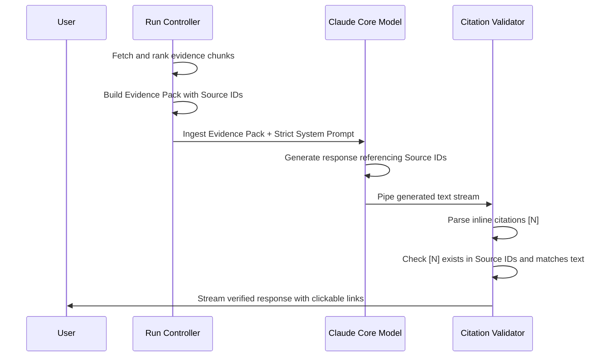

# Native Research Engine

This document outlines the system architecture, component schemas, error-handling strategies, and implementation roadmap for building a native, local-first research pipeline in Claude Code.

---

## 1. Scope & System Boundaries

### 1.1. Goal
Build a robust, local-first research pipeline that searches the web, fetches pages concurrently, caches sources locally as Markdown, ranks evidence, and synthesizes cited answers.

### 1.2. Four Core Pillars & GitHub Library Recommendations
Our pipeline is designed around four specialized data operations. To implement this natively with maximum stealth, speed, and reliability, we have selected top-tier, state-of-the-art open-source libraries from GitHub matching the philosophy of **Scrapling**:

| Pillar | Recommended Library (GitHub) | Language | Key Synergy & Technical Rationale |
| :--- | :--- | :--- | :--- |
| **1. Search (Discovery)** | [duckduckgo_search](https://github.com/deedy5/duckduckgo_search) | Python | **Zero-API-key**, ultra-fast text and news searches. Allows our query planner to discover relevant URLs in milliseconds without relying on paid developer keys. |
| **2. Scrape (Ingestion)** | [Scrapling](https://github.com/D4Vinci/Scrapling) + [Trafilatura](https://github.com/adbar/trafilatura) | Python | **Scrapling** provides undetectable, hardened stealth fetchers to bypass Cloudflare and Turnstile. **Trafilatura** strips HTML noise (ads, menus) and extracts clean Markdown body text alongside crucial metadata (author, date, title) for our frontmatter. |
| **3. Crawl (Exploration)** | [Crawl4AI](https://github.com/unclecode/crawl4ai) or [Crawlee](https://github.com/apify/crawlee) | Python / TS | **Crawl4AI** is specifically built for AI/RAG pipelines, generating LLM-ready clean Markdown outputs while crawling. **Crawlee** is the gold-standard TypeScript crawler with automated parallelization, request queues, and robust session/proxy pools. |
| **4. Extract (Reasoning)** | [Instructor](https://github.com/jxnl/instructor) | Python / TS | Leverages Zod (TS) or Pydantic (Python) to force LLMs to output strict, schema-validated JSON, enabling us to extract verified factual claims from Markdown chunks deterministically. |

### 1.3. Non-Goals
*   Do not replicate the full Perplexity interface or feature set in Phase 1.
*   Do not scrape every page with full browser automation.
*   Do not generate uncited factual claims.

---

## 2. Core Architecture

The pipeline processes external queries through a multi-stage local RAG loop, writing state to a persistent run directory.

```mermaid
graph TD
    User([User Input]) -->|"/research <query>"| Parser[1. Command Parser]
    Parser -->|Query string| Planner[2. Research Planner]
    Planner -->|Search (Discovery)| Search[3. Web Search APIs (duckduckgo_search)]
    Search -->|Target URLs| Scraper[4. Python Scrapling/Trafilatura Subprocess (Scrape)]
    Scraper -->|Save to Disk| Cache[(.claude/research/runs/ID/sources/*.md)]
    Cache -->|Crawl/Read Sources| Chunker[5. Token/Section-Aware Chunker]
    Chunker -->|Evidence Pack (Extract)| Ranker[6. BM25 / Reranker]
    Ranker -->|Top Chunks| Synthesis[7. Constrained LLM Synthesis]
    Synthesis -->|Citation Mapping| Validator[8. Citation Validator]
    Validator -->|Final Answer| Display([Terminal Console])
```

---

## 3. Component Specifications & Schemas

### 3.1. Command Parser & Command Resolution
To prevent ambiguity between queries and subcommands, we enforce the following syntax rule:
*   Any command beginning with double hyphens (`--`) is treated as a utility subcommand.
*   All other strings are treated as direct search queries.

```typescript
const UTILITY_COMMANDS = new Set(['--init', '--doctor', '--save', '--sources', '--claims', '--report']);

export function parseResearchCommand(args: string): { type: 'utility' | 'query'; command: string; payload: string } {
  const trimmed = args.trim();
  const firstWord = trimmed.split(/\s+/)[0]?.toLowerCase();

  if (firstWord && UTILITY_COMMANDS.has(firstWord)) {
    return {
      type: 'utility',
      command: firstWord,
      payload: trimmed.slice(firstWord.length).trim()
    };
  }

  return {
    type: 'query',
    command: 'search',
    payload: trimmed
  };
}
```

### 3.2. Web Scraper Engine (Python Scrapling Helper)
To bypass anti-bot protections (Cloudflare, Akamai, Turnstile) with high reliability and stealth, the fetcher is implemented as a **Python helper script** using the [Scrapling](https://github.com/D4Vinci/Scrapling) framework.

The Bun/TypeScript application executes Scrapling as a subprocess:
```typescript
import { spawnSync } from 'child_process';

type ScrapeResult = {
  status: 'ok' | 'failed';
  html?: string;
  markdown?: string;
  title?: string;
  error?: string;
};

export function runScraplingScraper(url: string): ScrapeResult {
  const process = spawnSync('python', ['scripts/scrape.py', url], {
    encoding: 'utf-8',
    timeout: 5000 // 5-second hard limit
  });

  if (process.error || process.status !== 0) {
    return { status: 'failed', error: process.stderr || 'Subprocess execution failed' };
  }

  return JSON.parse(process.stdout.trim()) as ScrapeResult;
}
```

#### Python Bridge Script (`scripts/scrape.py`):
```python
import sys
import json
from scrapling import Fetcher
import trafilatura

def main():
    if len(sys.argv) < 2:
        print(json.dumps({"status": "failed", "error": "No URL provided"}))
        sys.exit(1)
        
    url = sys.argv[1]
    try:
        # Utilizing Scrapling's stealth browser-based fetcher for robust bypass
        fetcher = Fetcher(url, auto_match=True)
        
        # Use Trafilatura to extract high-quality, noise-free main text/markdown
        clean_text = trafilatura.extract(fetcher.content, output_format='markdown')
        
        result = {
            "status": "ok",
            "title": fetcher.title,
            "html": fetcher.content,
            "markdown": clean_text or fetcher.text
        }
        print(json.dumps(result))
    except Exception as e:
        print(json.dumps({"status": "failed", "error": str(e)}))
        sys.exit(1)

if __name__ == "__main__":
    main()
```

### 3.3. Fetch Policy & Guardrails
```typescript
type FetchPolicy = {
  timeoutMs: number;
  maxConcurrent: number;
  respectRobotsTxt: boolean;
  userAgent: string;
  allowStealthFallback: boolean;
  domainBlocklist: string[];
  maxRetryAttempts: number;
};

const DEFAULT_FETCH_POLICY: FetchPolicy = {
  timeoutMs: 3000,
  maxConcurrent: 5,
  respectRobotsTxt: true,
  userAgent: 'ClaudeCodeResearchAgent/1.0',
  allowStealthFallback: true,
  domainBlocklist: ['youtube.com', 'facebook.com', 'twitter.com', 'instagram.com'],
  maxRetryAttempts: 2
};
```

### 3.4. Markdown Source Schema with Frontmatter
Every scraped source is saved in `.claude/research/runs/<run_id>/sources/<source_id>.md` with structured metadata frontmatter.

```markdown
---
source_id: src_001
url: https://example.com/article
canonical_url: https://example.com/article
title: Example Article
author: Jane Doe
published_at: 2026-05-20
retrieved_at: 2026-05-30T12:00:00+07:00
content_hash: sha256:e3b0c44298fc1c149afbf4c8996fb92427ae41e4649b934ca495991b7852b855
extractor: scrapling-stealth
status: ok
---

# Example Article

This is the cleaned body text of the article...
```

### 3.5. Token/Section-Aware Chunking Schema
Chunking operates on heading paths and token boundaries with a 10% overlap to preserve semantic context.

```typescript
type SourceChunk = {
  chunkId: string;
  sourceId: string;
  url: string;
  title: string;
  headingPath: string[];
  text: string;
  tokenCount: number;
  charStart: number;
  charEnd: number;
};
```

### 3.6. Evidence Budgeting & Dynamic Reranking
We avoid dominance of a single source by implementing dynamic budgeting and source diversity rules.

```typescript
type EvidenceBudget = {
  maxChunks: number;
  maxTokens: number;
  maxChunksPerSource: number;
  requireSourceDiversity: boolean;
};

const DEFAULT_BUDGET: EvidenceBudget = {
  maxChunks: 20,
  maxTokens: 6000,
  maxChunksPerSource: 3,
  requireSourceDiversity: true
};
```

### 3.7. Run Manifest
State persistence is tracked via a centralized `manifest.json` inside each run directory.

```typescript
type ResearchRunManifest = {
  runId: string;
  query: string;
  createdAt: string;
  searchProvider: string;
  sourceCount: number;
  chunkCount: number;
  status: 'running' | 'completed' | 'failed';
  errors: Array<{
    phase: string;
    message: string;
    timestamp: string;
  }>;
};
```

---

## 4. Citation & Validation Loop (Evidence-First Flow)

We ensure factuality by providing context before response generation and validating citations deterministically.



---

## 5. Failure Scenarios & Error Recovery

| Failure Point | Impact | Recovery Action |
| :--- | :--- | :--- |
| **Search Provider Failure** | High | Fall back immediately to secondary search provider APIs. |
| **URL Fetch Timeout** | Medium | Terminate connection at 3000ms; mark source as failed in manifest; proceed with remaining URLs. |
| **Python Scrapling Failure** | Medium | Log error; fall back to standard HTTP fetch inside TypeScript; discard source if both fail. |
| **Markdown Too Short** | Low | Reject and discard source if length < 200 characters. |
| **Duplicate Source Content** | Low | Compare SHA256 hashes of cleaned text; drop duplicates. |
| **Unsupported Citation** | High | Strip citation and flag statement as ungrounded during post-validation check. |
| **Context Limit Exceeded** | High | Dynamically compress the evidence pack using summaries of lower-ranked chunks. |

---

## 6. Implementation Roadmap

```carousel
### v0 MVP
1. Install Python dependencies: `pip install scrapling trafilatura duckduckgo_search` & `scrapling install`.
2. Write Python scraping bridge `scripts/scrape.py` leveraging Scrapling & Trafilatura.
3. Parse `/research <query>` and `--flags` in TS command entry point.
4. Execute search via `duckduckgo_search` and scrape via Bun subprocess.
5. Save Markdown files with metadata and generate `manifest.json`.
<!-- slide -->
### v1 Retrieval & Extraction
1. Slice Markdown files using section-aware/token-aware chunker.
2. Rank retrieved chunks using lexical BM25 indexing.
3. Build XML Evidence Pack.
4. Ingest pack to Claude with strict prompt rules and generate basic cited report.
<!-- slide -->
### v2 Validation & Deep Reranking
1. Integrate local bi-encoder embedding reranking using `@xenova/transformers`.
2. Implement strict citation mapping validator.
3. Verify claims against original chunk texts.
4. Export and save verified `citations.json`.
<!-- slide -->
### v3 UX & Crawling
1. Build Ink terminal progress UI.
2. Render clickable hyperlinks for terminal environments.
3. Integrate website Crawling using `Crawl4AI` (Python) or `Crawlee` (TS) for portal research.
4. Implement `/research --open`, `/research --sources`, and `/research --report`.
```
